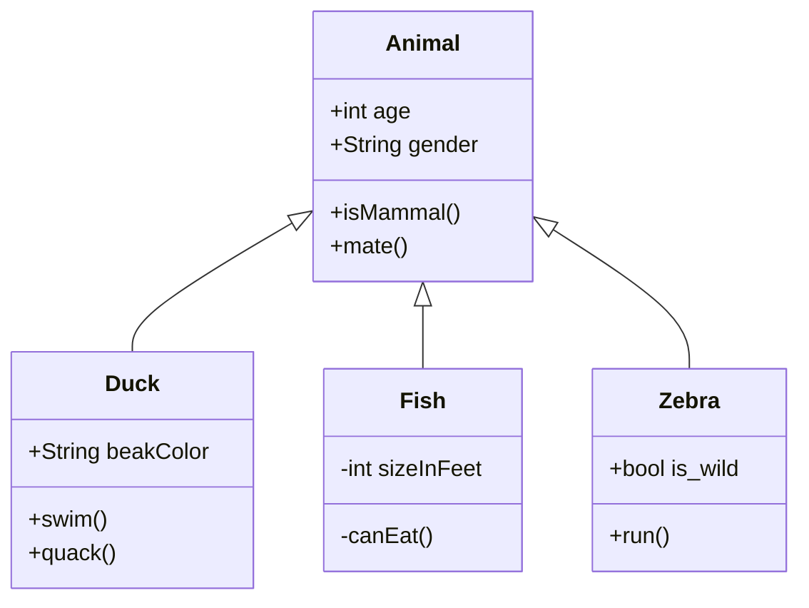

# Design patterns examples
Simple examples on how to implement design patterns in various languages

## Structure
Every pattern is categorized in subdirectories, based on:

1) Design pattern category (Creational, Structural, Behavioral)

2) Design pattern name (Factory, State, etc...)

3) Implementation language (C++, Python, Rust)

## Documentation structure
A markdown readme has to be implemented for every pattern, along with eventual
additional description

## Another example with Mermaid

### [Class Diagram](https://mermaid-js.github.io/mermaid/#/classDiagram)

