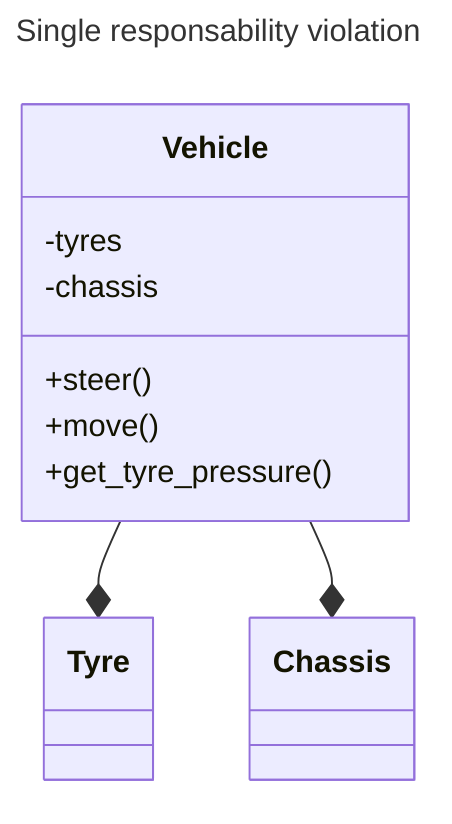

# SOLID

The acronym represent a set of principles in order to build clean code.
Rispectively:

* S: Single responsability

* O: Open/closed principle

* L: Liskov substitution

* I: Interface segregation

* D: dependency inversion

## Single responsability

This principle says that every object should be implmented to care/cover only
about a single functionality.

* Example: the class "vehicle" (below) is violating the single responsability principle.
Why? The vehicle should perform only the basic operation we expect from it. Hence the
method ```get_tyre_pressure()``` should not belong to the class, but to another, related
either to diagnostics or the tyres.



## Open/closed principle

Open/closed principle says that object entities (classes, modules, functions) should be
open for extensions and closed for modifications. It should be possible to add new
functionalities to a class without modifying its existing code.

* Example: the code below violates the open close principle. Why? Calculating the area
that way oblige to update the function everytime we have to add a shape (e.g. what 
happens if i need to add a Circle??).

```c++
#include <iostream>

class Rectangle {
public:
    Rectangle(double width, double height) : width_(width), height_(height) {}

    double getWidth() const { return width_; }
    double getHeight() const { return height_; }

private:
    double width_;
    double height_;
};

class AreaCalculator {
public:
    double calculateArea(const Rectangle& shape) {
      return shape.getWidth() * shape.getHeight();
    }
};

// Usage
void printArea() {
    const Rectangle rect(3.0, 2.0);
    AreaCalculator area_calc;
    std::cout << "Area: " << area_calc.calculateArea(rect) << std::endl;
}
```

What is the solution then?  Instead of modifying the existing class each time we
add a new shape, we can leverage inheritance and polymorphism to achieve the
open-closed principle.

```c++
#include <iostream>

class Shape {
public:
    virtual double calculateArea() const = 0;
};

class Rectangle : public Shape {
public:
    Rectangle(double width, double height) : width_(width), height_(height) {}

    double getWidth() const { return width_; }
    double getHeight() const { return height_; }

    double calculateArea() const override {
        return width_ * height_;
    }

private:
    double width_;
    double height_;
};

class Circle : public Shape {
public:
    Circle(double radius) : radius_(radius) {}

    double calculateArea() const override {
        return PI * radius_ * radius_;
    }

private:
    double radius_;
};

// Usage
void printArea(const Shape& shape) {
    std::cout << "Area: " << shape.calculateArea() << std::endl;
}

```

## Liskov substitution

This principle requires subclasses to not only satisfy the syntactic expectations but\
also the behavioral ones, of its parents. To view things from a different perspective,
as a user of a class, I should be able to utilize any of its children that may be passed
to me without caring about which particular child I am calling. This means we have to
ensure that the arguments as well as all the return values of the children are consistent.

__Important: this is not only related to matching the method syntactics (return values,
etc) but also to the functional semantic! (e.g. if a base class returns a float value
between -20 and 20 but the base class returns a value between 33 and 142 then this is
also a violation).__

* Example: in this case the provided abstract method fly is violating the Liskov
substitution since the penguins cannot fly. This violation can lead to unexpected behavior
when code expects a generic Bird to be able to fly but instead gets a swimming penguin.

```c++
#include <iostream>

class Bird {
public:
    virtual void fly() {
        std::cout << "A bird is flying." << std::endl;
    }
};

class Penguin : public Bird {
public:
    void fly() override {
        std::cout << "A penguin is either walking, sliding or swimming, not flying!"
        << std::endl;
    }
};

void makeBirdFly(Bird& bird) {
    bird.fly();
}

int main() {
    Bird bird;
    Penguin penguin;

    makeBirdFly(bird);     // Output: A bird is flying.
    makeBirdFly(penguin);  // Output: A penguin is either walking, sliding or swimming, not flying!

    return 0;
}
```

In practice, you will see the violation of this principle manifesting itself either
in bugs or calls to methods that reveal information about the child specializing the
interface. To fix the code above, it is just necessary to adjust the interface, by
making it more generic and/or make sure it might fit for every subclass. In this case
it is simply enough to opt for ```move()``` instead of ```fly()```. Every bird moves!

```c++
#include <iostream>

class Bird {
public:
    virtual void move() {
        std::cout << "A bird is moving." << std::endl;
    }
};

class Penguin : public Bird {
public:
    void move() override {
        std::cout << "A penguin moves by walking, sliding or swimming!" << std::endl;
    }
};

void makeBirdMove(Bird& bird) {
    bird.move();
}

int main() {
    Bird bird;
    Penguin penguin;

    makeBirdMove(bird);     // Output: A bird is moving.
    makeBirdMove(penguin);  // Output: A penguin moves by walking, sliding or swimming!

    return 0;
}
```
