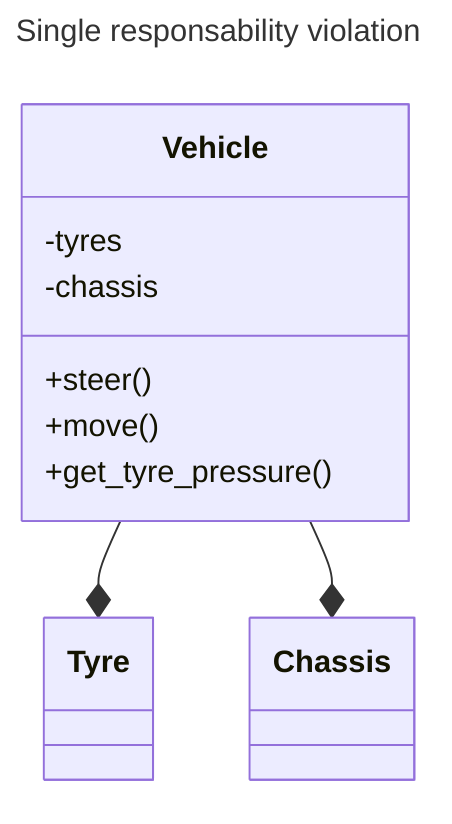

# SOLID

The acronym represent a set of principles in order to build clean code.
Rispectively:

* S: Single responsability

* O: Open/closed principle

* L: Liskov substitution

* I: Interface segregation

* D: dependency inversion

## Single responsability

This principle says that every object should be implmented to care/cover only
about a single functionality.

* Example: the class "vehicle" (below) is violating the single responsability principle.
Why? The vehicle should perform only the basic operation we expect from it. Hence the
method ```get_tyre_pressure()``` should not belong to the class, but to another, related
either to diagnostics or the tyres.



## Open/closed principle

Open/closed principle says that object entities (classes, modules, functions) should be
open for extensions and closed for modifications. It should be possible to add new
functionalities to a class without modifying its existing code.

* Example: the code below violates the open close principle. Why? Calculating the area
that way oblige to update the function everytime we have to add a shape (e.g. what 
happens if i need to add a Circle??).

```c++
#include <iostream>

class Rectangle {
public:
    Rectangle(double width, double height) : width_(width), height_(height) {}

    double getWidth() const { return width_; }
    double getHeight() const { return height_; }

private:
    double width_;
    double height_;
};

class AreaCalculator {
public:
    double calculateArea(const Rectangle& shape) {
      return shape.getWidth() * shape.getHeight();
    }
};

// Usage
void printArea() {
    const Rectangle rect(3.0, 2.0);
    AreaCalculator area_calc;
    std::cout << "Area: " << area_calc.calculateArea(rect) << std::endl;
}
```

What is the solution then?  Instead of modifying the existing class each time we
add a new shape, we can leverage inheritance and polymorphism to achieve the
open-closed principle.

```c++
#include <iostream>

class Shape {
public:
    virtual double calculateArea() const = 0;
};

class Rectangle : public Shape {
public:
    Rectangle(double width, double height) : width_(width), height_(height) {}

    double getWidth() const { return width_; }
    double getHeight() const { return height_; }

    double calculateArea() const override {
        return width_ * height_;
    }

private:
    double width_;
    double height_;
};

class Circle : public Shape {
public:
    Circle(double radius) : radius_(radius) {}

    double calculateArea() const override {
        return PI * radius_ * radius_;
    }

private:
    double radius_;
};

// Usage
void printArea(const Shape& shape) {
    std::cout << "Area: " << shape.calculateArea() << std::endl;
}

```
