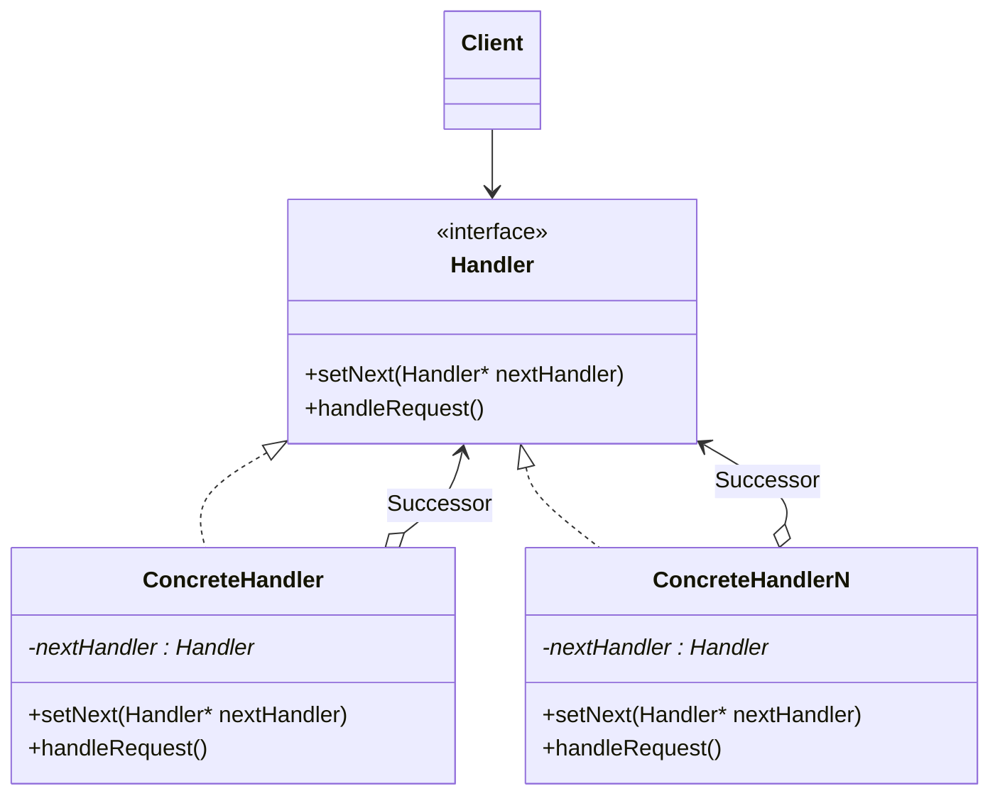

# Chain of Responsibility

Allows an object to pass a request along a chain of potential handlers until the request
is handled or reaches the end of the chain. Each handler in the chain has the ability
to either handle the request or pass it to the next handler in the chain. This pattern
__decouples the sender of the request from its receivers__, giving multiple objects the
opportunity to handle the request independently.

The class diagram is pretty simple, consisting in a ```handler``` interface and many
concrete ```handler``` classes, one per every different "handling" implementation we
want to have. With "handling" implementation is literally what the current handler should
do, amongst the following points:

* perform an operation

* pass the ball (the responsibility) to the next handler

* Mix of the two point above

## Real life practical example

A real world example for the chain of responsibility is the chain of command in a company.
For example if an employee needs an approval for a task, the employee gives the report to
the reference manager.
If the manager can’t approve the report, for example because the decision requires the
intervention of an upper manager,
he gives the report to the upper manager until a person with enough authority is found
or until the report is rejected.

## When is useful?

* When you want to decouple a request’s sender and receiver
* Multiple objects, determined at runtime, are candidates to handle a request
* When you don’t want to specify handlers explicitly in your code
* When you want to issue a request to one of several objects without specifying the
  receiver explicitly.

## Implementation

The following scheme is not following the usual representation. Usually the nextHandler_
member is placed in the Handler class and the child classes implements only
the methods. Preferred this way to have Handler as interface.

Another way possible would be implement a BaseConcrete class implementing a base version
of setNext() and handleRequest() plus adding the nextHandler_ member. Then create
BaseConcrete derived classes overriding the methods when a custom one is needed.


