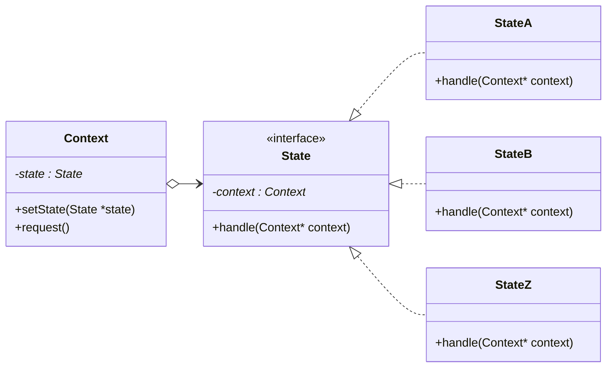
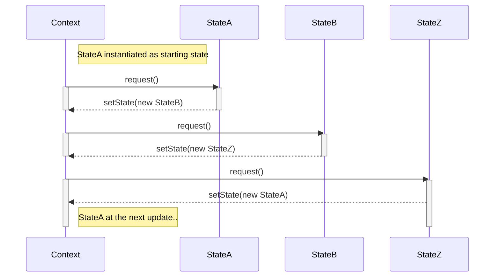

# State pattern

This pattern that allows an object to alter its behavior when its internal state changes.
It encapsulates different behaviors into separate state objects and delegates the
execution of behavior to the current state object.
This pattern promotes loose coupling between the object and its behavior, making it easier
to add or modify states without impacting the object's code.

It consists of:

* Context: this is the main considered object, with a changing internal state

* States: derived classes in charge of manage the internal state of the system

In a nutshell, hte context work as a "FSM execution environment":

* Every time a ```request()``` is called, the internal FSM evolves (A state handle is called)

* Every time a ```setState(State *state)``` is called, the state is changed (context update his state)



Implementation example sequence diagram:


