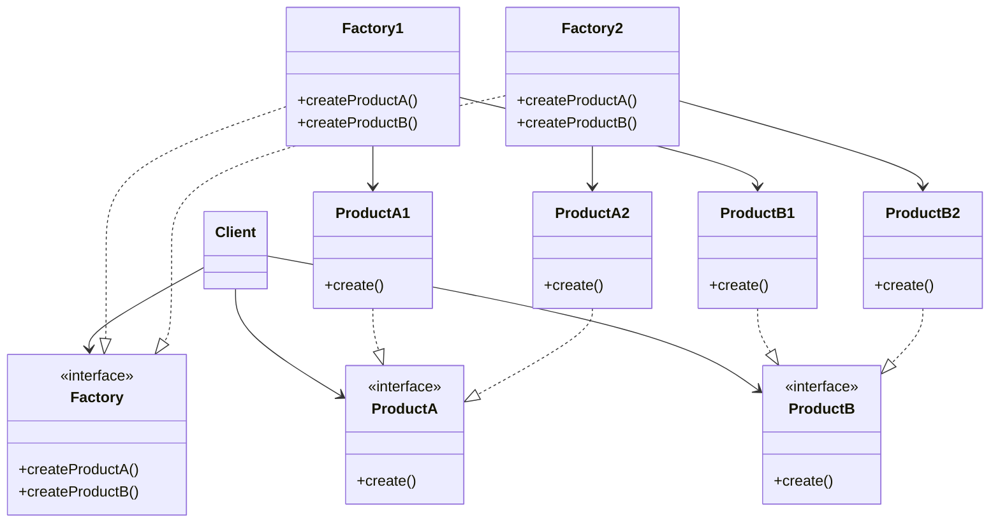

# Abstract factory

The abstract factory is a design pattern that provides a way to create families
of related objects without imposing their concrete classes, by encapsulating a
group of individual factories that have a common theme without specifying their
concrete classes.

## Real life practical example

The pattern can be seen as the creation of multiple factories or production
lines, with the role of creating different products which share common
characteristics (e.g. many factories all producing the same bicycle parts, but
every single factory specialized in the same parts for specific sectors like
race cycling, city bikes, mountain bicycles.)

## When is useful?

Compared to other design patterns and also to the other simpler factory
implementations, the abstract factory can be very useful when we want to:

- create different types of factories which have many characteristics in
    common
- have the freedom to change factories at run time.

## Implementation

