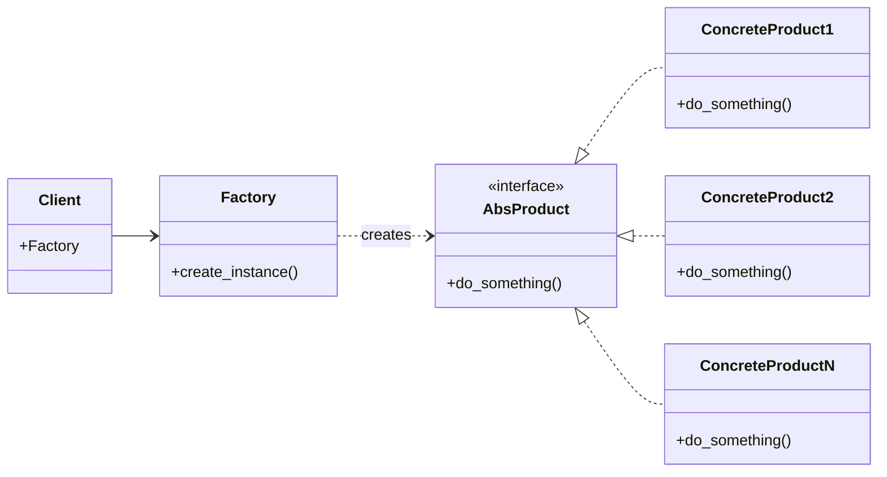
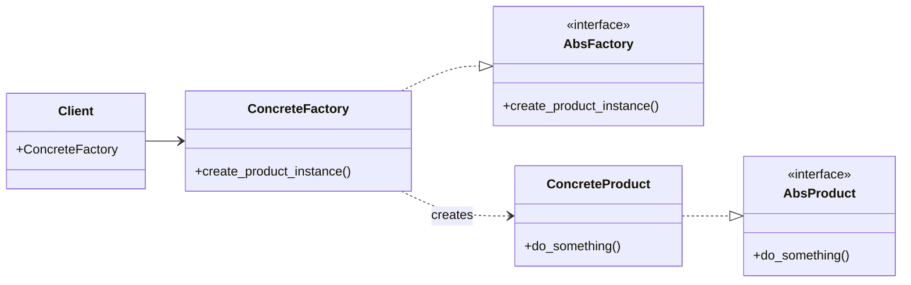

# Factory pattern

This pattern uses factory methods to deal with the problem of creating objects without
having to specify the exact class of the object that will be created. This is done by
creating objects by calling a factory method rather than by calling a constructor.

## Single factory

Pros:

* Eliminates open/closed violation: no need for modification to extend the products

* Eliminate dependencies: the main program is not interested to the concrete product
  implementation. Knowing the interface methods is enough.

* Separated concerns: separated the product load from the main program

Cons:

* Limited to only one factory

## Full factory

Pros (additional vs simple):

* Adding an abstract class for factories makes the things more manageable/vary (many
  factorioes can be implemented)

Cons (additional vs simple):

* Still not the best as the simple factory if we need more many lines for many different
  products
