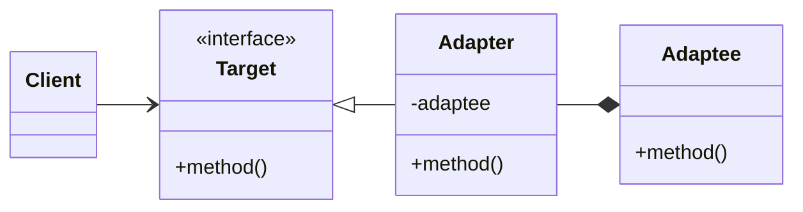
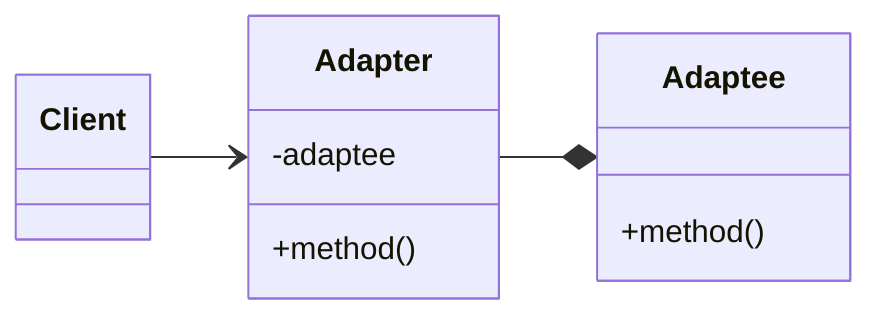
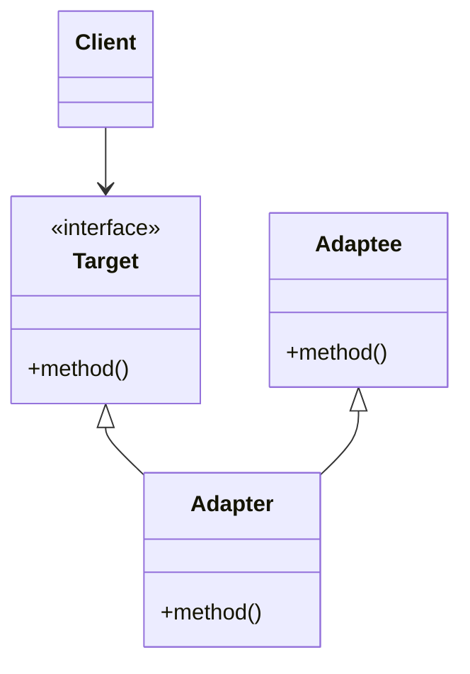

# Adapter

Interface that makes two different element that cannot naturally interact due to some
inconsistencies.

Two key elements:

* Target: the interface that the client want to call

* Adaptee: the incompatible class that needs to be adapted to be called correctly by
  the client (might be legacy or useful but not compatible with the current client
  implementation.)

* Adapter: the class that has to adapt the target to the adaptee

## Real life practical example

Typically the brighter example is the electricity plug adapter. It permits to make your
devices with EU plug to work with non EU plugs. In that case, those are the roles:

* Target = EU plug

* Adaptee = Might be US plug or else

* Adapter: the device properly joining the plugs connectors

## When it is usually necessary?

In general we opt for that if one of the part of the software to connect cannot be
changed.

* __Legacy code__: adapters are usually implemented to keep the legacy code working while
  proceeding in the refactoring.

* __Multiple classes with different API__: we need to bring in some third party software
  and we need to adapt to the API which are not originally built for our system, or just\
  adapt many classes to look the same to be re-used by the same part of our code.

## Implementations

Usually this pattern implementation is also referred as wrapper. There mainly two ways to
implement the adapter pattern: object and class adapters.

More specifically, the problem covered in the example is:

We have a project implementing a media player. The media player rely on a single function
named "play". Unfortunately the new advanced media player functionalities coming from the
other team is composed of 2 different APIs:

* One for the audio reproduction

* One for video reproduction

We will adopt the adapter pattern in order to link properly our (client) function with
the received APIs.

### Object adapter

The object adapter way implements the target interface by delegating to an adaptee
object at run-time (generally the preferred one).
Generically:

* Use composition

* Can be used with subclasses

* Can have multiple adaptees

* Cannot override behavior

#### interface class adapter

#### Concrete class adapter

### Class adapter

The class adapter way implements the target interface by inheriting from an adaptee
class at compile-time (generally adopted only for special reasons, reduce the footprint
or enhance performances).
Generically:

* Use inheritance

* Commit to concrete implementation

* Only a single adaptee

* Can override adaptee behavior

