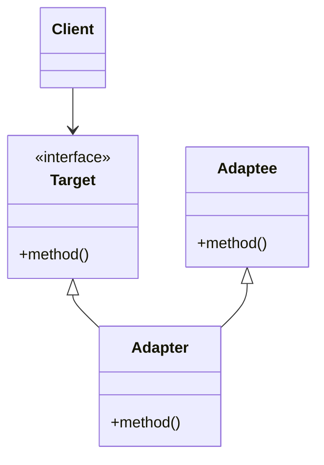

# Adapter

Interface that makes two different element that cannot naturally interact due to some
inconsistencies.

## Real life practical example

Typically the brighter example is the electricity plug adapter. It permits to make your
devices with EU plug to work with non EU plugs.

## When it is usually necessary?

In general we opt for that if one of the part of the software to connect cannot be
changed.

* __Legacy code__: adapters are usually implemented to keep the legacy code working while
  proceeding in the refactoring.

* __Multiple classes with different API__: we need to bring in some third party software
  and we need to adapt to the API which are not originally built for our system, or just\
  adapt many classes to look the same to be re-used by the same part of our code.

## Implementations

The adapter make sure the a target interface (the one that the client is expecting
to call) is adapted to an adaptee concrete class (the class that is incompatible).

Following the socket plug adapter, the adaptee role would be physically link the plug
connectors to the other plug in the optimum way.

There are many ways to do that:

### Object adapter

The object adapter way implements the target interface by delegating to an adaptee
object at run-time.
Generically:

* Use composition

* Can be used with subclasses

* Can have multiple adaptees

* Cannot override behavior

### Class adapter

The class adapter way implements the target interface by inheriting from an adaptee
class at compile-time.
Generically:

* Use inheritance

* Commit to concrete implementation

* Only a single adaptee

* Can override adaptee behavior

