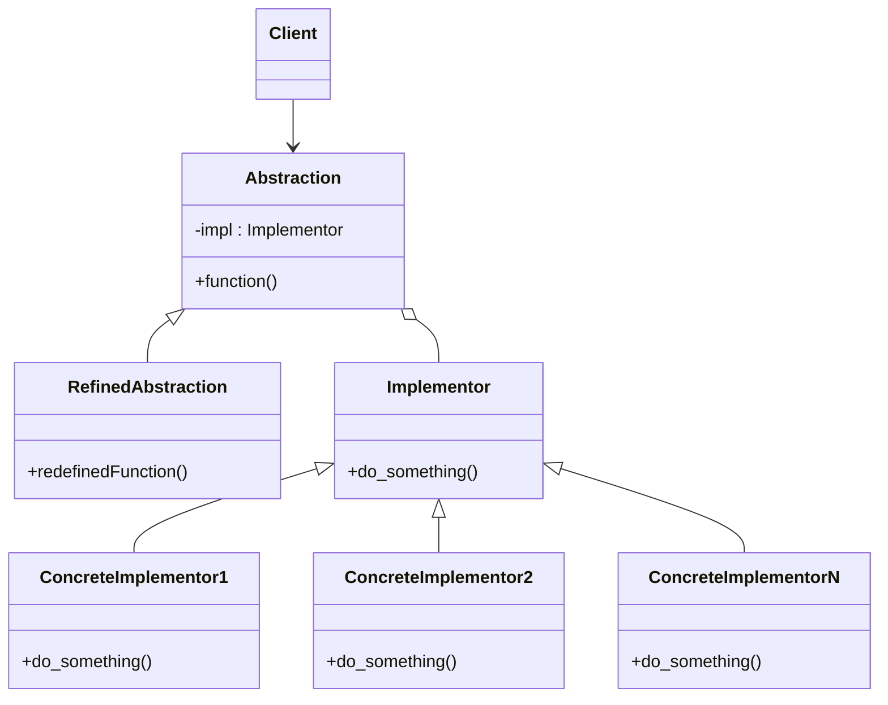

# Bridge

This pattern wants to separate an object abstraction from its implementation and make them
vary independently. The Bridge pattern is especially useful when dealing with
cross-platform apps, supporting multiple types of database servers or working with several
API providers of a certain kind (for example, cloud platforms, social networks, etc.)

* __Note: differently from the adapter pattern (which adapt some existing code to the
  client implementation), bridge pattern is oriented not only to avoid any changes in the
  client code, but also to think about future implementations by making possible to
  add extensive functionalities by subclassing.__

Pros:

* Replace inheritance with composition

* Avoid complex inheritance trees

* Enhance testability

* Promote code reusability

Cons:

* Increasing complexity

* Increasing maintenance effort

## PIimpl

Bridge is also linked partially to the PIimpl idiom (Pointer to implementation). This
technique is used to separate the implementation from the interface. This minimizes header
exposure and helps programmers to reduce build dependencies by moving the private data
members in a separate class and accessing them through an opaque pointer.

Pros:

* Maintain binary compatibility

* Reduce compilation time

* Hide internal data, dependencies

Cons:

* Increase memory management overhead

* Maintenance overhead (every interface is split in original and impl class)

* Complicate inheritance
